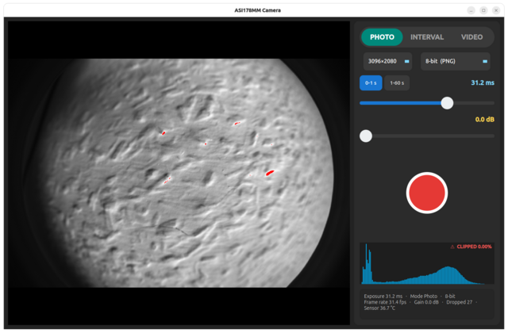
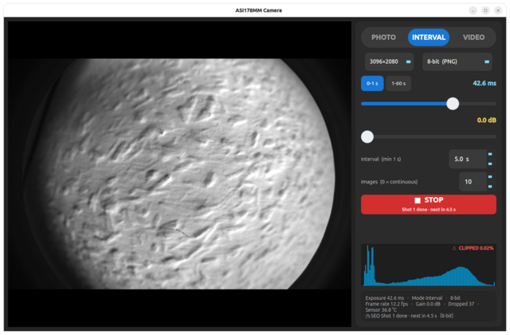
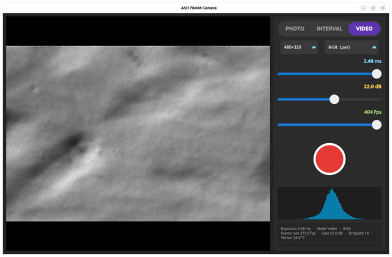

# ASI Camera App

Project article: [A Linux Capture App for the ZWO ASI178MM](https://hotto.de/software-hardware/a-linux-capture-app-for-the-zwo-asi178mm/)
(the article is from the project's Linux era — the build it describes was
reworked into the pure-Windows build documented here).

## Use cases

1. **Infrared Photography and Video** — when using a mono camera like the
   ASI178MM, the unfiltered sensor sees near-infrared light as well as
   visible light; put an IR-pass (or visible-block) filter on the optics to
   pick the band, then capture IR stills in photo mode or full-frame IR
   video in video mode.
2. **All Sky Camera** — aim a fisheye lens at the sky and let interval mode
   take long-exposure sequences (up to 60 s per shot) at a fixed interval:
   timelapse material for the Milky Way, aurora, and cloud cover, with every
   frame saved as a 14-bit TIFF.
3. **Astro Photography** — exposures up to 60 s and fixed-interval sequences
   of 14-bit TIFF stills give stackable data for deep-sky imaging, with the
   live histogram and clipping warning helping to keep long exposures in
   range.
4. **High Speed Video** — when using the ASI178MM with a small ROI of
   480×320, high capture rates up to ~400 fps are achievable.

The three capture modes:

| **Photo** — single frames | **Interval** — exposure sequences | **Video** — H.264 MP4 or `.ser` recording |
|:---:|:---:|:---:|
|  |  |  |

A desktop app for **ZWO ASI cameras** on Windows (USB3, mono or colour). It
is built against the ZWO SDK in general — so it works with all ASI cameras —
and has been **developed and tested with the ASI178MM (mono) and the
ASI178MC (colour)**, both 3096×2080 sensors with 2.40 µm pixels. It has
three capture modes:

- **Photo** — snap single frames.
- **Interval** — back-to-back long-exposure sequences with a fixed **interval
  between shots** (the next shot starts `interval` seconds after the previous
  image was captured — the interval always elapses, even when the exposure is
  longer than the interval).
- **Video** — record **8-bit** clips as H.264 MP4, or **8/14-bit** clips as
  uncompressed `.ser` (full sensor bit depth, large files).

**Mono cameras save single-channel data; colour cameras save RGB.** Nothing is
chosen by hand and nothing is hard-coded: at startup the app asks the connected
camera what it is (its name, its sensor size, which resolutions and bit depths
it can read out, its exposure limits, its gain range, whether it has a Bayer
mosaic) and builds the panel from the answer. Plug a different ASI body in and
the selectors, labels and limits follow it.

| | a **mono** body (e.g. ASI178MM) | a **colour** body (e.g. ASI178MC) |
|---|---|---|
| Preview | grayscale (clipped pixels red) | colour (clipped blocks red) |
| Photo / Interval | 8-bit **1-channel PNG**, 14-bit **1-channel 16-bit TIFF** | 8-bit **RGB PNG**, 14-bit **RGB 16-bit TIFF** |
| Video H.264 | MP4 from grayscale frames | MP4 from RGB frames |
| Video `.ser` | `ColorID = 0` (**MONO**, 1 plane) | `ColorID = 100` (**RGB**, 3 channels interleaved per pixel: R,G,B) |

A colour camera is captured as its raw **Bayer mosaic** (1 byte/px on the fast
readout, 2 on the deep one) and demosaiced to RGB on the host — never as the
camera's own RGB24 readout, which costs 3 bytes/pixel at the *slow* rate and
would halve the frame rate for nothing. That means the saved RGB is the honest
mosaic data — with the camera's white balance baked in if you let it: **AWB is
on by default on a colour camera** (see the controls below), and what it (or
your manual sliders) do happens in the camera before the mosaic is read out.
Uncheck AWB and leave both sliders at their anchor (6500 K, tint 0) and the
balance stops moving on its own: it sits at the camera's **measured neutral** —
no colour cast under daylight-ish light, and no automatic decisions in your
frames. (The balance is always baked in on a colour camera; if you want the raw
mosaic with no in-camera colour processing at all, that is what a mono body is
for.)

The window shows a **live preview on the left** and **all controls in a large,
touch-friendly panel on the right** (dark theme). A 128-bin histogram sits in
the same panel, with the **clipping warning** painted in its top-right corner
(red `⚠ CLIPPED x.xx%`) and the clipped pixels marked red in the preview.

---

## Installing the app (Windows 10/11 x64)

You need one of two things — both have **identical contents** (the self-
contained `package_win\` folder):

* the **`.msi` installer** — `camera_app-1.1.0-x64.msi`, or
* the **portable zip** — `asi_camera_capture-win-x64.zip` (a zipped
  `package_win\`).

### Option A: install with the .msi (recommended)

1. Double-click `camera_app-1.1.0-x64.msi`.
2. A Windows Installer progress box appears and **finishes in a few seconds —
   it closing right away is the install succeeding, not a failure**: the
   installer has no setup screens and needs **no administrator rights**.
3. Done. The app is installed **for your user only** into
   **`%LOCALAPPDATA%\ASI Camera Capture`** — for the current user that is
   `C:\Users\<you>\AppData\Local\ASI Camera Capture`. Open that folder from
   the Run dialog (**Win+R**, type `%LOCALAPPDATA%\ASI Camera Capture`,
   Enter) or paste the path into the Explorer address bar.

The installer creates **no Start-Menu or desktop shortcut**: start the app by
double-clicking `camera_app.exe` in that folder (it opens **without a command
window**). If you want a shortcut: right-click `camera_app.exe` → *Send to* →
*Desktop (create shortcut)*.

**Uninstall:** *Settings → Apps → Installed apps → ASI Camera Capture* →
Uninstall — or from a command prompt:
`msiexec /x {E5829535-BC75-4B62-A790-D78A3FC89459} /qn`. Uninstalling removes
the app only; your captured photos/videos are left where they are.

### Option B: portable zip (no install)

Unzip anywhere you like (e.g. `C:\ASI Camera Capture`) and run
`camera_app.exe` from the unzipped folder. No administrator rights, nothing
written to the registry; the folder is self-contained and can be moved or
deleted as a whole.

### Both options

* **First launch:** the build is not code-signed yet, so Windows may show a
  **SmartScreen** warning on the first start — *More info → Run anyway*.
* **The camera driver is a separate one-time install** (Prerequisites, step
  2 below): neither the app nor the installer carries the ZWO driver.
* **Where to find things** — the app creates `photos\`, `videos\` and
  `sequences\` folders **next to the executable it was started from** (for an
  app you start by double-clicking, that is the folder the exe lives in):

  | What | Where |
  |---|---|
  | The app (installed) | `%LOCALAPPDATA%\ASI Camera Capture\camera_app.exe` |
  | Photos | `...\ASI Camera Capture\photos\photo_<timestamp>.png` / `.tif` |
  | Videos | `...\ASI Camera Capture\videos\video_<timestamp>.mp4` / `.ser` |
  | Interval sequences | `...\ASI Camera Capture\sequences\seq_<timestamp>\NNNN.*` |

  (Portable zip: the same folders appear next to your unzipped
  `camera_app.exe`.) See [Where files go](#where-files-go) for the naming and
  format details.

---

## Prerequisites (Windows 10/11 x64)

**End users only need step 2 below — the camera driver —** everything else is
already inside the app package. Building from source needs:

Everything the build needs is **vendored in the tree** (`third_party/` and
`ASI_SDK/`): no system Qt, OpenCV or GStreamer installation is needed, and a
camera is only required at **run** time, not to compile. Two one-time things
per machine:

**1. C++ toolchain.** Install **Microsoft Visual Studio 2022** — Build Tools
or Community, both free — from <https://visualstudio.microsoft.com/downloads/>,
selecting the **"Desktop development with C++"** workload (MSVC x64 build
tools + the Windows SDK). `build_win.bat` finds `vcvars64.bat` in the standard
install locations on its own (Community/Professional/Enterprise under
`C:\Program Files`, BuildTools under `C:\Program Files (x86)`); if your copy
lives elsewhere, point it at the file with the `VCVARS` environment variable.

**2. ZWO camera driver (runtime only).** The ZWO SDK — the app's and any
third-party tool's (SharpCap, ZWO Assistant, …) — can only talk to the camera
through ZWO's **native Windows driver**. Without it the camera shows in Device
Manager with a warning (*Problem 28*, unknown class) and the app sits at
"Waiting for camera…". One-time per machine:

1. Download the signed installer (publisher: SUZHOU ZWO CO., LTD.):
   `https://dl.zwoastro.com/software?app=AsiCameraDriver&platform=windows64&region=Overseas`
   (a 4.5 MB `ZWO_ASI_Cameras_driver_Setup_V3.28.0.0.exe`).
2. Run it **as administrator** (double-click, approve the UAC prompt, Next).
3. Verify: Device Manager now lists the body as **"ZWO ASI178MC Camera"**
   (class *Image*, no warning icon). Unplug/replug the camera if the device
   still shows the warning.

The vendored dependency tree (ships with the project copy; the table gives the
upstream source if a piece ever turns out to be missing):

| Path | What it is | Upstream source |
|---|---|---|
| `third_party\qt\6.7.3\msvc2019_64\` | Qt 6.7.3 (bin: `moc.exe`, `windeployqt.exe`; `include\`; `lib\`; `plugins\platforms`) | the Qt online archive 7z files **qtbase** + **qttools**, `https://download.qt.io/online/qtsdkrepository/windows_x86/desktop/qt6_673/qt.qt6.673.win64_msvc2019_64/` — extract both 7z archives into `third_party\qt\6.7.3\msvc2019_64\` |
| `third_party\opencv\opencv\build\` | OpenCV 4.12.0 official Windows binaries (single `opencv_world4120.dll` + import lib + headers under `build\`) | `https://github.com/opencv/opencv/releases/download/4.12.0/opencv-4.12.0-windows.exe` — a 7-Zip SFX, extract with the 7-Zip console: `7z x opencv-4.12.0-windows.exe` (the Inno-style silent flags do nothing) |
| `third_party\gst\` | GStreamer 1.24.12 prebuilt (C-ABI) — `include\`, `lib\` import libs, `runtime\` (38 DLLs), `plugins\` (107 DLLs incl. the 5 the encoder needs) | MSYS2 packages from `https://repo.msys2.org/mingw/` — mostly the **mingw64** repo (gstreamer, gstreamer-plugins-base/good/ugly, glib2, pcre2, zlib, zstd, libwinpthread, gcc-libs) plus **ucrt64** (gettext-runtime, libiconv, orc, libx264 0.164); assembly recipe (merge prefixes, rename `*.dll.a` → `*.lib`, keep `glibconfig.h` on the include path): `docs/build.md` §5 |
| `third_party\extract\cmake-3.29.6-windows-x86_64\` | CMake 3.29.6 (used from the zip, no install) | `https://github.com/Kitware/CMake/releases/download/v3.29.6/cmake-3.29.6-windows-x86_64.zip` |
| `ASI_SDK\` | the ZWO SDK x64 (`ASICamera2.lib` + `ASICamera2.dll`, `ASICamera2.h`, `license.txt`) | the ZWO SDK download — vendored in the tree |

`build_win.bat` also falls back to a `cmake` on your `PATH` (any CMake ≥ 3.25,
from <https://cmake.org/download/>) if the vendored copy is ever missing.

---

## Building and running

```bat
build_win.bat all       # configure (vcvars64 + moc + CMake) + build (nmake)
build_win.bat package   # assemble the self-contained package_win\ folder
build_win.bat clean     # remove build_win\ and package_win\
```

That builds the app **twice from the same sources**:

* `build_win\camera_app.exe` — the **console-subsystem** twin. Kept for the
  headless self-tests and command-line diagnostics.
* `build_win\gui\camera_app.exe` — the **GUI-subsystem** build (CMake
  `WIN32_EXECUTABLE`, entry point `mainCRTStartup`). Windows gives every
  console-subsystem exe a command window; the GUI-subsystem build opens the
  same window **without one**, so it is what users run.

**`package_win\`** ships the GUI build: `camera_app.exe` + every runtime DLL
it loads (Qt6Core/Gui/Widgets, `opencv_world4120.dll` + ffmpeg videoio,
`ASICamera2.dll`, the whole GStreamer + glib runtime set), the five encoder
plugins in `gstreamer-1.0\`, the Qt platform plugins in `platforms\`, plus
`README.md` and the ZWO `license.txt`. It runs from **any** working
directory. True single-file embedding is not possible with dynamically linked
Qt/OpenCV/GStreamer — the self-contained folder is the deliverable. The target
machine needs the standard VC++ runtime (present on every current Windows) and
the step-2 driver.

Headless verification (the first block needs no camera):

```bat
build_win\camera_app.exe -platform offscreen --sertest --frametest --capstest
build_win\camera_app.exe -platform offscreen --colourtest --wbtest --fpstest
```

Every suite prints `PASS` / `OK` and exits with code 0. Then start the GUI
(the package ships the GUI-subsystem exe — it opens **without a command
window**):

```bat
package_win\camera_app.exe
```

With the camera plugged in (and the driver installed) the preview appears on
its own and the status line reports the probed values;
`build_win\camera_app.exe --smoke` runs the full camera self-test. If the GUI
stays at "Waiting for camera…", check the driver (Prerequisites, step 2) and
make sure no other program is holding the camera (only one process may hold
it at a time).

### Distributing the app (and the .msi installer)

Two supported shapes, identical contents — the `package_win\` folder from
above:

* **Zipped folder (portable).** Zip `package_win\` (PowerShell:
  `Compress-Archive package_win\* asi_camera_capture-win-x64.zip`). The
  recipient unzips and runs `camera_app.exe` — no install step, no admin
  rights, nothing written to the registry, easy to move. Best for hand-offs
  and quick tests.
* **`.msi` installer (per-user install).** `build_msi.bat` packages the same
  folder into **`dist\camera_app-1.1.0-x64.msi`** with the **WiX Toolset
  3.14.1** (vendored in `third_party\wix\`; if missing, fetch the `wix314`
  release binaries — `wix314-binaries.zip`,
  `https://github.com/wixtoolset/wix3/releases/tag/wix3141rtm` — into
  `third_party\wix\`; `tools\dlwix.mjs` automates the download). The
  installer is a **per-user** install: no administrator rights, the app lands
  in `%LOCALAPPDATA%\ASI Camera Capture`, it registers under *Add or remove
  programs* (uninstaller + upgrade support through the fixed `UpgradeCode`;
  the `Product/@Id` is a **fixed literal GUID** in `dist\wix\camera_app.wxs`
  - never `Id="*"`, because a regenerated code per rebuild produced
  duplicate *Add/Remove* entries; docs/build.md section 5), and it ships the
  GUI-subsystem exe. End users install it by double-clicking the `.msi`
  (brief progress box, done in seconds - see "Installing the app" above).
  The ZWO
  **driver is deliberately not bundled** — it stays the separate per-machine
  signed install from Prerequisites. Install and uninstall silently:

  ```bat
  msiexec /i dist\camera_app-1.1.0-x64.msi /qn
  msiexec /x dist\camera_app-1.1.0-x64.msi /qn
  ```

  Both shapes ship the same verified bits; for a publicly distributed release
  the remaining polish step is **code signing** (Authenticode on the exe /
  the MSI), which removes SmartScreen warnings on first launch.

---

## Several cameras connected

If **more than one ASI camera** is connected, the app asks which one to open
**on every launch**: a small window before the main window lists every
connected camera (its index, name, mono/colour and sensor size) —
**click the one the app should open** (that confirms it and the app opens;
Enter confirms the highlighted row, **Cancel**/Esc quits without opening
anything — there is no OK button, because clicking already confirms). The
app opens exactly the body you choose (the window title names it). With a single camera there is no dialog — it is opened as before. You
can also select from the command line with `camera_app.exe --camera N` (N =
the number shown in the selector, or the camera's internal ID), which skips
the dialog.

---

## The controls (right panel)

These are shared by all three modes:

| Control | What it does |
|---|---|
| **PHOTO / INTERVAL / VIDEO** | The mode switch (top of the panel). |
| **Image size** | Sensor region to use — full frame (3096×2080) down to smaller crops. Smaller regions give higher frame rates. The list is **probed at startup**: every size in it is one this camera actually accepted, and sizes are kept even so the Bayer phase of a colour sensor cannot shift. |
| **Bit depth** | The choices depend on the mode **and on what the camera can read out**. **Photo/Interval:** 8-bit → PNG, 14-bit → 16-bit TIFF. **Video:** 8-bit → H.264 MP4, or 8-bit / 14-bit → uncompressed `.ser`. (The two 8-bit video choices are H.264 MP4 or `.ser`.) On a colour camera every entry says so — "8-bit RGB (PNG)", "14-bit RGB (16-bit TIFF)", "8-bit RGB (H.264)", "14-bit RGB (.ser)" — because that is what lands on disk. A body with no 2-byte readout simply gets no deep entry. |
| **Exposure** | Logarithmic slider. Its range depends on the mode: **Photo/Interval** 32 µs…1 s (switch off) or 1…60 s (switch on), **Video** capped at the frame period (1/fps). In photo and interval mode the **Range** switch — on the exposure row, above the slider — toggles the range between **0-1 s** and **1-60 s** — pick 1-60 s for long exposures: in that range the slider is **linear with 1 s steps** (1 s at the left end, 60 s at the right, the handle snaps to whole seconds). Switching clamps the current exposure to the new range. The switch is shared between photo and interval mode — its state persists when you switch. **When the exposure exceeds one frame period, the live preview runs at the full exposure on the video stream**: the camera stretches its frame period to match the exposure, so the preview updates once per exposure and shows the true brightness — at 1 s it updates every second, at 60 s once a minute. Below the frame period the preview is the normal fast video stream. |
| **Gain** | Slider in **0.1 dB steps** that brightens/darkens the sensor signal — its range comes from the camera (the ASI178MM's 0.0…40.0 dB, the ASI178MC's 0.0…51.0 dB), so it cannot be pushed past what the body supports. Applies in all three modes — set it once and it stays (the camera keeps it between runs). |
| **White balance** *(colour cameras only)* | A row that appears as soon as a **colour** camera is connected: **AWB** — the camera's automatic white balance, **on by default** — plus **Temperature** (2500…10000 K) and **Tint** (−100 green … +100 magenta) sliders. While AWB is checked the sliders are greyed out and retain your last manual values. Unchecking AWB applies those values immediately. Dragging either slider changes the image as it moves, with camera updates paced to protect the video stream; releasing it applies the final value. The sliders have no tooltips. The two labels show **exactly the balance you set** — Temperature and Tint are fully independent: moving one never drags the other, and what the labels say is what you set (no asterisks). White-balance headroom is finite: where the camera cannot deliver the full balance, one channel runs into its cap and the other carries the balance, so the temperature axis stays true (blue↔yellow) and the image carries what the hardware allows. The Kelvin scale is anchored to the camera's **measured** neutral point. The balance is applied in the camera and is baked into saved files; on a mono camera the row never appears and the data stays exactly as it came off the sensor. |

Below the mode switch, the panel shows the controls for the selected mode.

---

## Photo mode

1. Pick the **image size** and **bit depth**.
2. Set the **exposure** with the slider (the value is shown next to it). For
   exposures above 1 s, press the **1-60 s** range switch on the exposure row
   (above the slider) first, then set the exposure.
3. Adjust the **gain** if the image is too dark or too bright (higher gain =
   brighter, but more noise).
4. Press the round shutter button (red circle with a white ring). It dims
   while the exposure is in flight.

The frame is saved to `photos/photo_<timestamp>.png` (8-bit) or
`.tif` (14-bit, 16-bit TIFF).

**Live view speed:** the preview is shown as a downscaled thumbnail (built on
a dedicated preview thread), while photos and recordings always stay
full-resolution. The preview refreshes at a fixed **~30 fps in every mode
(photo, interval, video) — independent of the recording frame rate**: recording
at 1 fps or 300 fps both give a 30 fps preview, and nothing is rebuilt more
often than 30 fps (faster would only waste CPU — the display repaints at 30 Hz
anyway). The 30 fps clock runs on a dedicated preview-builder thread, off the
frame-drain loop. OpenCV's thumbnail resize uses one internal worker so its CPU
work does not interrupt the camera stream. The preview can only show frames the
camera actually delivered: at full frame the camera delivers ~60 fps (8-bit,
the fast 10-bit readout) to ~28 fps (14-bit), so the 30 fps preview is fully
supplied there; if the camera delivers slower (e.g. a slow photo exposure shows
at 1/exposure, a running sequence once per shot), the preview updates at that
slower rate until frames arrive again.

## Interval mode

Back-to-back long-exposure captures. **There is no separate exposure control** —
the sequence uses the **main exposure slider** and its **Range** switch
(0-1 s / 1-60 s, exactly like photo mode), so set your exposure there first.

1. Set the **exposure** with the main slider (top of the panel). For exposures
   above 1 s, press the **1-60 s** range switch on the exposure row (above the
   slider) first (the slider is then linear with whole-second steps).
 2. Set the **Interval** — the time between shots (1 s minimum, up to 1200 s).
    It is the gap that always elapses after each image is captured, *before* the
    next exposure starts — independent of how long the exposure is.
 3. Set **Images** — how many shots to take (**0 = continuous** until you stop).
 4. Press **▶ START SEQUENCE** (it turns red **■ STOP** while running).
  
  **How the timing works:** the next shot starts exactly `interval` seconds after
  the previous image was captured (i.e. after its exposure finished). The interval
  is the time *between* images, so it always elapses, even when the exposure is
  longer than the interval. Total time per shot ≈ `exposure + interval`:
  
  - 0.5 s exposure, 5 s interval → 5 s between images (exposure, then the full
    5 s interval).
  - 30 s exposure, 5 s interval → the 30 s exposure is followed by the full 5 s
    interval (35 s between images) — the interval is *not* skipped just because
    the exposure is long.
  
  While a sequence runs the live preview is paused; it resumes when the sequence
  finishes or you press **■ STOP**. Images save to
  `sequences/seq_<timestamp>/NNNN.<ext>` (zero-padded shot number, PNG or 14-bit
  TIFF as set by the bit depth). The button shows the current shot, the count,
  and a live countdown to the next one — it counts the interval down after every
  image, and while the next exposure itself runs the line shows
  “Exposing shot N / M…”.

## Video mode

1. Pick the **frame rate** with the slider. Its maximum depends on the image size
   **and** the bit-depth/format (from the camera's USB3.0 spec): 8-bit H.264 tops
   out at **60 fps**; 14-bit `.ser` follows the 14-bit spec column; 8-bit
   `.ser` follows the faster 10-bit column. The exposure is automatically capped at
   the frame period (you can't expose longer than one frame).
2. Pick the **bit depth**: **8-bit (H.264)** — small compressed MP4 — or
   **8-bit / 14-bit (.ser)** — uncompressed, full sensor bit depth, large files
   (interleaved RGB = 3 bytes/px on a colour camera, so three times the bytes of mono).
3. Press **● RECORD** (it turns red **■ STOP** while recording).

8-bit H.264 video is written to `videos/video_<timestamp>.mp4`. 8/14-bit `.ser`
video is written to `videos/video_<timestamp>.ser` (uncompressed — 8-bit stores
1 byte/plane/pixel, 14-bit 2; a colour body writes 3 channels **interleaved per
pixel (R,G,B)** — the layout SER v3 defines for `ColorID 100` and the one Siril,
Ser-Player and FireCapture-style tools read (full R/G/B planes render as a
3×3 mosaic of the scene in those players), a mono body
1; the largest files, so disk writes are the bottleneck). Higher frame rates need a smaller image size — full-resolution
video tops out at ~28 fps (14-bit) to ~60 fps (8-bit, the fast 10-bit readout),
and small image sizes run much faster (up to ~400 fps at 480×320 on the 10-bit
readout). The live preview is unaffected by the frame-rate slider: it always
runs at a fixed ~30 fps while recording (and in every other mode), whatever
the recorded rate.

**14-bit `.ser` and stacking tools.** 14-bit `.ser` stores 2 bytes/pixel with
the value **left-justified (MSB-aligned)** in the 16-bit container (the 14-bit
readout as-is, 0…65528), and the header declares `PixelDepthPerPlane = 16` —
the container width — rather than 14. That is the one representation every
`.ser` reader decodes to a correct full-range image: Siril reads the 16-bit
word as-is (and always labels its own 2-byte files 16-bit), while tools that
shift or normalise by the declared depth do nothing at all for 16. Declaring 14
instead makes depth-aware tools clip the image to white or render it at
1/4…1/64 brightness. The pixel data is little-endian, and the header's
`LittleEndian` field (offset 22) is written **0** — the de-facto convention of
the original SER tools, Siril and GoQat, where 0 means "little-endian data"
(the spec's written meaning of the flag is the opposite; writing 1 makes those
readers byte-swap every pixel and the image comes out as noise). The effective
bit depth is implicit in the data (values top out at 65528, in steps of 4), so
nothing is lost — the sensor's full range is preserved.

---

## Where files go

Output is written to folders **next to where the app was started** (its
current working directory — for an app you start by double-clicking the exe,
that is the folder the exe lives in; for the installed app that is
`%LOCALAPPDATA%\ASI Camera Capture\`):

| Mode | Folder | File naming |
|---|---|---|
| Photo | `photos/` | `photo_<yyyyMMdd_HHmmss>.png` / `.tif` |
| Interval | `sequences/` | `seq_<yyyyMMdd_HHmmss>/NNNN.png` / `.tif` |
| Video | `videos/` | `video_<yyyyMMdd_HHmmss>.mp4` (8-bit H.264) / `.ser` (8/14-bit, MONO or RGB) |

**14-bit** stills (Photo and Interval) are saved as **16-bit TIFF** so the full
sensor range is preserved. **8-bit H.264 video** is a small compressed MP4;
**8/14-bit `.ser` video** is uncompressed, so the full bit depth is preserved
there (at the cost of large files). A colour camera's files hold **RGB** —
3-channel PNG/TIFF and 3-plane `.ser` (`ColorID = 100`, planes in the order
R, G, B) — a mono camera's hold a **single channel** (`ColorID = 0`).

---

## Troubleshooting

- **Camera not found / "waiting for camera".** First make sure no other
  instance of the app (or any other program) is holding the camera — only one
  process can hold it at a time. If the camera is clearly connected but the
  app still waits, the usual cause is the missing **ZWO camera driver** (the
  app itself and the bundled `ASICamera2.dll` do not carry a driver): without
  it the camera shows in Device Manager with a warning (Problem 28,
  "Unbekannt"/Unknown class) and the app — or SharpCap, or any other ZWO SDK
  tool — cannot see it. One-time fix: download the signed driver installer from
  `https://dl.zwoastro.com/software?app=AsiCameraDriver&platform=windows64&region=Overseas`
  (v3.28.x, "ZWO_ASI_Cameras_driver_Setup…") and run it as administrator.
  After that the device appears as **"ZWO ASI178MC Camera"** and the app
  discovers it. Every Windows machine the app runs on needs this step once.
- **Camera lost / "stuck".** The camera's USB connection can re-enumerate
  (wobbly cable, re-plug, or the brief "stuck" state seen right after closing
  the app). The app detects a lost camera, shows a red
  **"Camera lost - reconnecting..."** status line, and re-opens the camera on
  its own the moment it answers again — no restart needed. At startup the same
  applies: if the camera is unavailable, the app waits and re-probes every
  second, so plugging it in while the app is open is enough.
- **8-bit H.264 video recording errors / no MP4.** GStreamer loads the encoder
  plugins (`x264enc`, …) at runtime from the `gstreamer-1.0\` folder that sits
  next to the exe (the package and both build-tree exes ship it — see
  Prerequisites). A `gst: …` message at the start of a recording means a
  plugin DLL is missing from that folder; (8/14-bit `.ser` recording is plain
  C++ and needs no GStreamer plugins at all).
- **8/14-bit `.ser` files are large.** `.ser` is uncompressed (8-bit: 1
  byte/pixel, 14-bit: 2 bytes/pixel): a full-resolution 14-bit clip is ~12.6 MB
  per frame, so disk space and write speed are the limit. Use a smaller image size
  or 8-bit H.264 MP4 for long clips.
- **Colours look wrong on a colour camera (skin tones cyan, R and B swapped).**
  The app demosaices with the Bayer pattern the camera reports. A rare body
  reports a pattern that does not match its data; `camera_app.exe --bayer rggb`
  (also `bggr`, `grbg`, `gbrg`) forces the order, so it can be checked without
  rebuilding. The headless `--colourtest` pins the mapping itself down, so a
  mismatch there is a camera-reporting issue, not a code issue.
- **Clipping.** If the red **⚠ CLIPPED x.xx%** readout appears in the
  histogram's top-right corner, part of the frame is at the sensor's maximum
  value (over-exposed); reduce the exposure.

---

## Developer notes

For the build system, architecture, threading model, and internal behaviour see
**[AGENTS.md](AGENTS.md)**.

The build is CMake + MSVC (`CMakeLists.txt`, driven by `build_win.bat`), with
all third-party dependencies vendored in `third_party/` — see
`docs/build.md` §5 for the dependency tree, the box-quirk workarounds and the
`.msi` packaging. The source is split into modules: `include/` (one header per
module), `src/` (one `.cpp` per module), and `tests/` (the headless self-test
suites driven by `--sertest` / `--frametest` / `--capstest` / `--colourtest`).
`camera_caps` is what the camera reports and everything the UI derives from it;
`colour` is the Bayer→RGB path (demosaic to interleaved RGB for `.ser`, colour
thumbnail). `build_win.bat` runs `moc` on the `Q_OBJECT` headers into
`build_win/moc_*.cpp`; all generated build artifacts live in `build_win/`.
